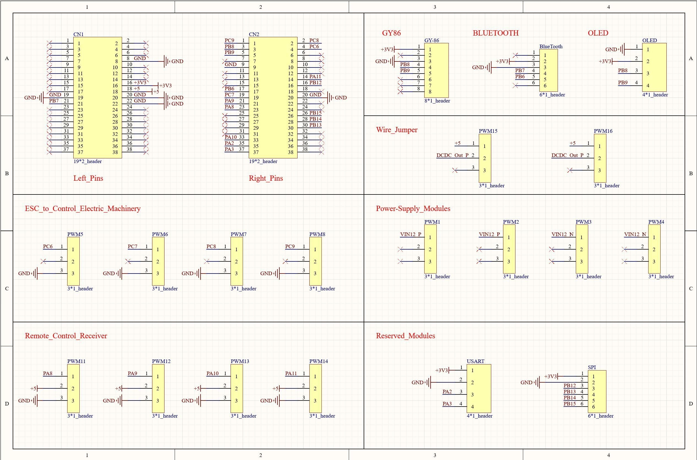
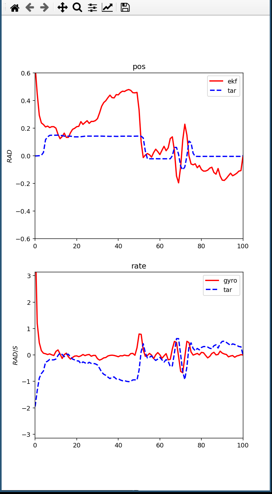

这是一个自制四轴飞机飞控代码仓库，基于 EKF

当前状态：`PID 调试`
支持的编译器：`arm-none-eabi-gcc`
使用构建工具：`cmake`

# 硬件选型
- MCU: stm32f401RET6
- IMU: GY-86
- Radio: flysky FS-i6(support 6 chs ppm)
- Reciever: flysky FS_iA6B(support 8 chs ppm)
- DCDC module


*NOTE: wire jumper 是用于电源供给切换（在 DCDC 模块和 USB 5V 之间）*

# 特性

- 在 STM32 完成的便于调试的简易 shell
- 基于 EKF 的姿态解算(with -O3 optimization:1000hz/with -g optimization:300hz)
- 基于 Eigen 的矩阵运算
- 串级 PID 的闭环控制
- tool 中基于 matplotlib 的数据图形化工具
> 


# 构建

使用 CMAKE
```bash
mkdir build
cd build
cmake .. -DCMAKE_BUILD_TYPE=Release
```


# 开发注意
1. 调用 intEnter （关中断）
2. 进行处理
3. 调用 intexit 标记需要上下文切换

如果在应用的程序中需要进行类似 enter critical 的行为可以调用
函数打开 schedule lock
